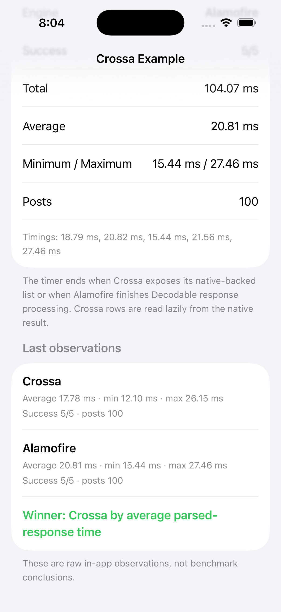

# Crossa iOS Example

This standalone SwiftUI app is the iOS counterpart to `../android-example`. It runs the same Crossa `.cra` graph and compares it with a conventional Alamofire 5.12.0 implementation against:

```text
GET https://jsonplaceholder.typicode.com/posts
```

The app runs five uncached requests with a two-second interval, matching the Android example’s request count, delay, endpoint, headers, timeout, and Crossa source graph. It retains only the final response for rendering.

## Requirements

- Xcode 26.2 or later with an iOS Simulator runtime
- iOS deployment target: 14.0
- A generated `Crossa.xcframework` containing both device and simulator slices
- Network access to resolve Alamofire 5.12.0 once through Swift Package Manager

The application target is iOS 14.0 for the SwiftUI lifecycle; the packaged Crossa XCFramework remains compatible with iOS 13.0.

## Install Crossa

Build the XCFramework from the Crossa source repository, outside this app:

```sh
crossa generate-build ios ./ios-example/crossa --output ./build/crossa-ios
```

Install the output into this consumer repository:

```sh
cd ios-example
./scripts/install-crossa-framework.sh ../build/crossa-ios/debug/Crossa.xcframework
```

The expected location is:

```text
CrossaBinary/Crossa.xcframework
```

`CrossaPackage/Package.swift` exposes that binary as the `Crossa` module. The Xcode project adds this package locally and links it normally; the app never compiles Crossa C++ sources or discovers a framework dynamically at runtime.

## Build and run

1. Open `CrossaIOSExample.xcodeproj` in Xcode.
2. Let Xcode resolve Alamofire 5.12.0 and the local Crossa package.
3. Select an iOS Simulator and run `CrossaIOSExample`.
4. Choose Crossa or Alamofire, then tap **Run 5 requests**.

For command-line validation after installing the framework:

```sh
xcodebuild -project CrossaIOSExample.xcodeproj \
  -scheme CrossaIOSExample \
  -destination 'platform=iOS Simulator,name=<available simulator>' \
  build
```

## Architecture

```text
SwiftUI
  ↓
PostsViewModel
  ↓
PostsRepositoryProtocol
  ├─ CrossaPostsRepository
  │    ↓
  │  generated CrossaFunctions.getPosts
  │    ↓
  │  Crossa.xcframework
  │    ↓
  │  C++ networking, parsing, native-backed CrossaList<Post>
  │
  └─ AlamofirePostsRepository
       ↓
     Alamofire Session
       ↓
     URLSession → Decodable → [AlamofirePostDTO]
```

The Crossa repository uses the actual generated module API:

```swift
CrossaFunctions.getPosts(runtime: runtime, onState: ...)
```

Its `CrossaList<Post>` is kept as the presentation-data owner. SwiftUI requests each visible row by index, so the app does not convert the Crossa result to an array or construct a duplicate full model graph. Alamofire keeps its normal decoded DTO array, preserving an honest architectural comparison.

## Request fairness and timing

Both engines use the same JSONPlaceholder endpoint, five request iterations, timeout intent, disabled cache policy, and request headers from `ExampleConfiguration`. Crossa still receives its generated `config.cra` configuration and its per-request headers from `postRequests.cra`.

The displayed monotonic duration starts at the application repository call and ends when the result is accessible to SwiftUI:

- Crossa: its native-backed list is available.
- Alamofire: Alamofire has completed `Decodable` response processing.

These values are raw observations only. The app makes no performance or winner claim.

## Cancellation and lifetime

The active Crossa `CrossaOperation` and Alamofire `DataRequest` are retained by their respective repositories and cancelled from the same UI action. A Crossa cancellation is surfaced as a cancelled screen state, not a generic error.

`AppContainer` owns one `CrossaRuntime` for the application lifetime. `PostsViewModel` owns the current presentation data, which in turn owns the Crossa native result for as long as SwiftUI reads it. Clearing results releases that reference through the generated Crossa ownership path.

## Latest run (2026-09-06)

Built from the rebuilt Crossa 0.1.0 host compiler and a freshly generated Debug `Crossa.xcframework` (`ios-arm64` + `ios-arm64-simulator`), then installed on an iPhone 17 Pro simulator running iOS 26.2. Each engine sent 5 uncached `GET https://jsonplaceholder.typicode.com/posts` requests with a 2000ms delay.

The app auto-ran the comparison twice during launch (SwiftUI `onAppear`). Both runs completed 5/5 with 100 posts:

| Run | Crossa average | Alamofire 5.12.0 average | Winner |
|---|---|---|---|
| 1 | 26.45 ms (min 11.90, max 80.24) | 24.18 ms (min 15.13, max 55.80) | Alamofire |
| 2 | **17.78 ms** (min 12.10, max 26.15) | 20.81 ms (min 15.44, max 27.46) | **Crossa** |

On iOS Simulator the two engines are close. The captured screen is run 2, where Crossa is slightly ahead:



These are raw in-app observations from the repository call until the parsed list is available to SwiftUI. They are not a formal device benchmark.

## Update the framework

Regenerate the XCFramework after changing files under `crossa/`, then rerun `scripts/install-crossa-framework.sh`. Do not edit generated Swift API types in this repository. If a module, simulator slice, or ABI defect appears, fix it in Crossa’s framework-generation pipeline rather than adding an app-side workaround.
